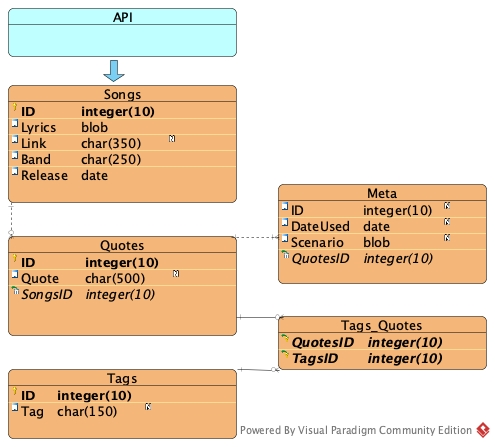

# My 80's Bard

## Welcome

Have you every wanted to create a character that has an encyclopedic knowledge of 80's song lyrics? They can't help yell out "I'm B-B-bad to the B-B-bone" when another character asks them why they try to do some kind of dumb seductive persuasion on another innocent maiden within the campaign? No? Well, this might not be the application for you. For all you other amazing writers and DnD players, welcome. This completely useless application is an homage to 80's rock hits, and my need to build an overly complicate tool for the purpose of bringing to life "My 80's Bard."

## Goals

### Project Goals

1. Collect Massive Amounts of 80's Song Lyrics within a Single DB
2. Build a Useful Quotable Lyric Library for my 80's Bard
3. Provide related data for those asking and music to set the ambiance during our campaign
4. Record meta data on when and how library provided relaxant data

### Personal Dev Goals

1. Accessing API and recording data within a new DB
2. Create DB using something other than IntelliJ and Java
3. Use Angular or React to build smooth web application that searches "local" DB for results
4. Post to Web for Wide Band Access
5. Become a Millionaire for such an amazingly creative application

## Plan

A plan? Who needs a plan? ... I do. I need a plan!
Well, it's not so much a plan as a direction. The following sub-items are essentially focus items needed to keep my mind caged on an attainable goal. You can expect this to be a living document. It will change as I think to add new modules to the plan. That said, this will not reflect my daily plans. If you want that, please see my log. It should be a lot more chaotic as I try to keep my ideals, lessons learned, and inspired grumblings compartmentalized.

### One

"Get and build song data within DB"

- [ ] Get Song Data From API
- [ ] Add Song Links to Song Table
- [ ] Build Quote From Song Record
- [ ] Add Tags to Quote

### Two

"Build Data Manipulate UI"

- [ ] Read Song Data
- [ ] Add URL Link (of music video or song) Btn
- [ ] Build Quote UI
- [ ] Assign Tags
- [ ] Add Tags to DB
- [ ] Add Scenario Quote is Used

### Three

"Build UI"

- [ ] Search by Word or Phrases
- [ ] Search by Tag
- [ ] Search by Quote Last Used
- [ ] Use Quote (Play song/video with link)

### Current DB Plan

